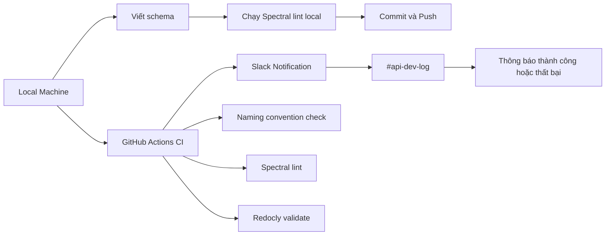

# Hướng Dẫn CI/CD — API Schema Workflow

> Tài liệu này dành cho toàn bộ team, bao gồm dev mới chưa quen với CI/CD lẫn dev đã có kinh nghiệm.
> Cập nhật lần cuối: 14/05/2026

---

## Mục lục

1. [Tổng quan hệ thống](#1-tổng-quan-hệ-thống)
2. [Quy tắc bắt buộc trước khi commit](#2-quy-tắc-bắt-buộc-trước-khi-commit)
3. [Flow làm việc hàng ngày](#3-flow-làm-việc-hàng-ngày)
4. [CI chạy gì khi mở PR?](#4-ci-chạy-gì-khi-mở-pr)
5. [Đọc lỗi Spectral](#5-đọc-lỗi-spectral)
6. [Slack Notification](#6-slack-notification)
7. [Câu hỏi thường gặp](#7-câu-hỏi-thường-gặp)

---

## 1. Tổng quan hệ thống



Hệ thống có **2 tầng bảo vệ**:

| Tầng | Chạy khi nào | Mục đích |
|------|-------------|----------|
| Local (Spectral CLI) | Trước khi push | Phát hiện lỗi sớm, không tốn CI minutes |
| GitHub Actions | Khi mở PR | Gate chính — block merge nếu vi phạm |

---

## 2. Quy tắc bắt buộc trước khi commit

### Naming Convention

| Đối tượng | Quy tắc | Ví dụ đúng | Ví dụ sai |
|-----------|---------|------------|-----------|
| Schema file | PascalCase | `CreateTicketRequest.yaml` | `create-ticket.yaml` |
| Path file | kebab-case | `create-ticket.yaml` | `CreateTicket.yaml` |
| Thư mục schema | `components/schemas/` | `components/schemas/ticket/` | `schemas/ticket/` |
| `operationId` | verbNoun | `createTicket`, `listUsers` | `create_ticket`, `Tickets` |
| Commit message | `feat(scope): mô tả` | `feat(schemas): add CreateTicketRequest` | `add schema` |

### Schema Rules

```yaml
# ✅ Đúng — dùng $ref
responses:
  200:
    content:
      application/json:
        schema:
          $ref: "#/components/schemas/TicketResponse"

# ❌ Sai — inline schema
responses:
  200:
    content:
      application/json:
        schema:
          type: object
          properties:
            id:
              type: string
```

```yaml
# ✅ Đúng — readOnly cho server-generated fields
components:
  schemas:
    Ticket:
      properties:
        id:
          type: string
          readOnly: true        # ← bắt buộc
        created_at:
          type: string
          format: date-time
          readOnly: true        # ← bắt buộc
```

```yaml
# ✅ Đúng — có đủ error responses
responses:
  200:
    description: Success
  400:
    $ref: "#/components/responses/BadRequest"
  401:
    $ref: "#/components/responses/Unauthorized"
  500:
    $ref: "#/components/responses/InternalServerError"
```

---

## 3. Flow làm việc hàng ngày

### Bước 1 — Setup lần đầu (chỉ làm 1 lần)

```bash
# Clone repo
git clone <repo-url>
cd <repo>

# Cài dependencies
npm install

# Kiểm tra Spectral đã hoạt động chưa
npx spectral lint openapi.yaml --ruleset .spectral.yaml
```

Nếu thấy output không có `error` đỏ → setup thành công.

### Bước 2 — Tạo branch mới

```bash
# Luôn tạo branch từ develop, không làm trực tiếp trên main
git checkout develop
git pull origin develop
git checkout -b feat/schema-ten-feature
```

Convention đặt tên branch:

| Loại | Pattern | Ví dụ |
|------|---------|-------|
| Feature | `feat/schema-*` | `feat/schema-create-ticket` |
| Fix | `fix/schema-*` | `fix/schema-missing-500` |
| Chore | `chore/*` | `chore/update-spectral-rules` |

### Bước 3 — Viết schema và lint local

```bash
# Sau khi viết xong, lint trước khi commit
npm run lint:api

# Nếu muốn lint 1 file cụ thể
npx spectral lint paths/tickets/create.yaml --ruleset .spectral.yaml
```

**Không commit nếu còn lỗi `error`.** Warning (`warn`) có thể commit nhưng phải fix trước khi merge.

### Bước 4 — Commit đúng format

```bash
# Format: feat(scope): mô tả ngắn gọn
git add components/schemas/ticket/CreateTicketRequest.yaml
git commit -m "feat(schemas): add CreateTicketRequest schema"

# Các scope thường dùng
feat(schemas): ...       # thêm schema mới
feat(paths): ...         # thêm path mới
fix(schemas): ...        # sửa lỗi schema
chore(spectral): ...     # cập nhật lint rules
docs(conventions): ...   # cập nhật tài liệu
```

### Bước 5 — Push và mở PR

```bash
git push origin feat/schema-create-ticket
```

Mở PR trên GitHub, điền mô tả theo template (xem phần PR bên dưới).

---

## 4. CI chạy gì khi mở PR?

Khi bạn mở PR vào `main` hoặc `develop`, GitHub Actions tự động chạy workflow `Validate OpenAPI Specification`:

```
Job: validate
├── 1. Checkout code
├── 2. Setup Node 20
├── 3. npm ci
├── 4. Check schema file naming (PascalCase)   ← fail → block merge ngay
├── 5. spectral lint (npm run lint:api)         ← fail → block merge
└── 6. redocly validate (npm run validate:api)  ← fail → block merge

Job: notify (chạy sau validate, dù pass hay fail)
└── Gửi message vào Slack #api-dev-log
```

**Merge chỉ được phép khi tất cả checks đều xanh.**

### Xem kết quả CI

1. Vào tab **Checks** trên PR
2. Click vào job `Validate OpenAPI Specification`
3. Xem log từng step — lỗi sẽ hiển thị rõ ở step nào fail

---

## 5. Đọc lỗi Spectral

### Cấu trúc một dòng lỗi

```
/path/to/file.yaml
  LINE:COL  SEVERITY  RULE-CODE  Mô tả lỗi   path.in.document
```

### Ví dụ thực tế và cách fix

**Lỗi 1 — Inline schema**
```
paths/tickets/create.yaml
  15:13  error  no-inline-schema-in-paths  Phải dùng $ref, không được inline schema.
```
→ Chuyển schema định nghĩa tại chỗ ra `components/schemas/` và dùng `$ref`.

**Lỗi 2 — Thiếu response 500**
```
paths/tickets/close.yaml
  20:13  warning  operation-must-have-500  Operation thiếu response 500.  put.responses
```
→ Thêm `500: $ref: "#/components/responses/InternalServerError"` vào `responses`.

**Lỗi 3 — operationId sai format**
```
paths/tickets/list.yaml
  5:17  error  operation-id-verb-noun  operationId "tickets_list" sai format.
```
→ Đổi thành `listTickets`.

**Lỗi 4 — Thiếu readOnly**
```
components/schemas/ticket/Ticket.yaml
  12:7  error  schema-id-must-be-readonly  Trường "id" phải có readOnly: true.
```
→ Thêm `readOnly: true` vào field `id`.

**Lỗi 5 — Tên file sai PascalCase**
```
❌ components/schemas/ticket/create-ticket-request.yaml → tên file phải là PascalCase
```
→ Đổi tên file thành `CreateTicketRequest.yaml`, cập nhật tất cả `$ref` trỏ đến file này.

---

## 6. Slack Notification

Mỗi khi có thay đổi trong `components/schemas/` được push lên, Slack channel `#api-dev-log` sẽ nhận được thông báo tự động:

```
✅ Schema Update — Passed
────────────────────────────────
Repo:     your-org/api-repo
Branch:   `feat/schema-create-ticket`
Author:   dinhnhan
Commit:   `a3f9c12`

Files thay đổi:
`components/schemas/ticket/CreateTicketRequest.yaml`

                    [ Xem CI Run ]
```

Message màu đỏ + tiêu đề `❌ Schema Update — Failed` nghĩa là CI fail — vào link **Xem CI Run** để xem chi tiết lỗi.

---

## 7. Câu hỏi thường gặp

**Q: Tôi push lên nhưng CI không chạy?**
A: CI chỉ trigger khi có thay đổi trong `components/schemas/**`, `**/*.yaml`, hoặc `**/*.yml`. Nếu chỉ sửa file khác (ví dụ `README.md`) thì CI không chạy — đây là cố ý để tránh tốn CI minutes.

**Q: Warning có cần fix không?**
A: Warning không block merge nhưng phải fix trước khi PR được approve. Các warning hiện tại: thiếu `401`, thiếu `500`, thiếu `404` cho path có `{id}`.

**Q: Tôi đổi tên schema file thì phải làm gì?**
A: Đổi tên file → tìm tất cả `$ref` trỏ đến file cũ và cập nhật. Dùng lệnh:
```bash
grep -r "OldFileName" --include="*.yaml" .
```

**Q: Sao tôi lint local thì pass nhưng CI lại fail?**
A: Thường do thiếu `npm ci` — dependencies local và CI có thể khác nhau. Chạy `npm ci` rồi lint lại.

**Q: Schema file của tôi nằm đúng `components/schemas/` nhưng vẫn bị báo lỗi naming?**
A: Kiểm tra **tên file** (không phải thư mục) có đúng PascalCase không. Ví dụ: `components/schemas/ticket/createRequest.yaml` → sai, phải là `CreateRequest.yaml`.

---

> Có thắc mắc hoặc muốn đề xuất thêm rule mới → tạo issue với label `dx/api-conventions` hoặc hỏi trực tiếp trong `#api-dev-log`.
